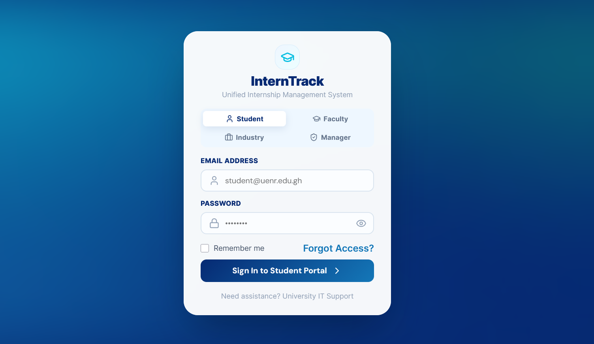
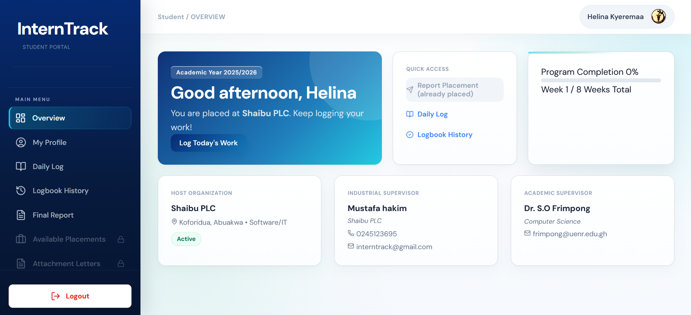
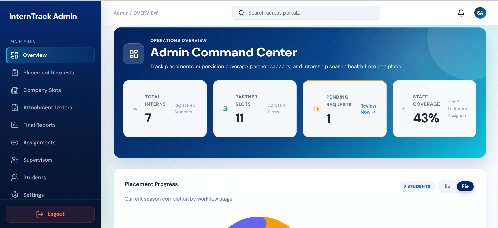
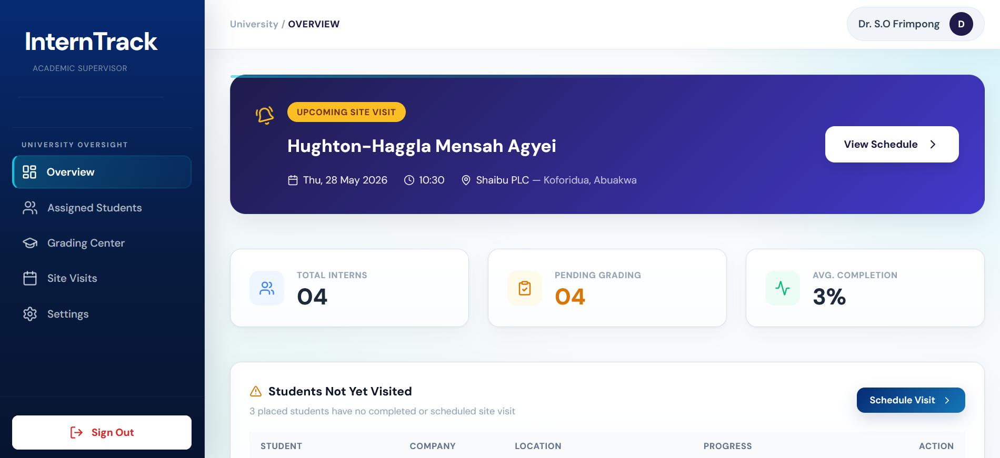
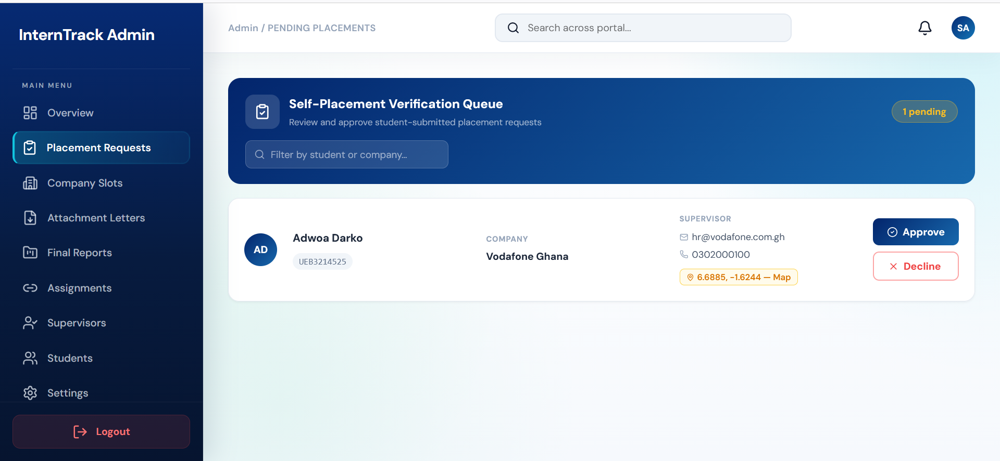
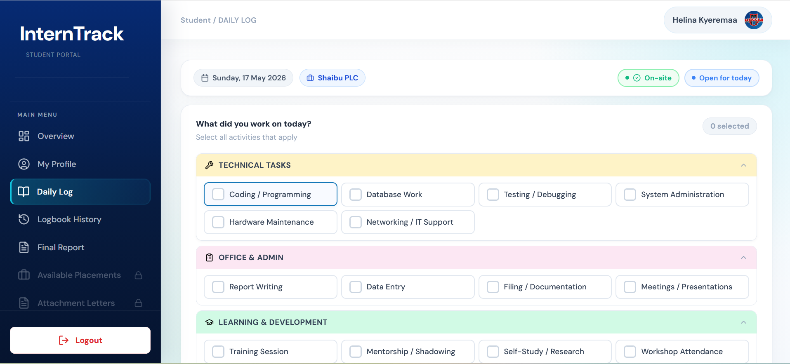
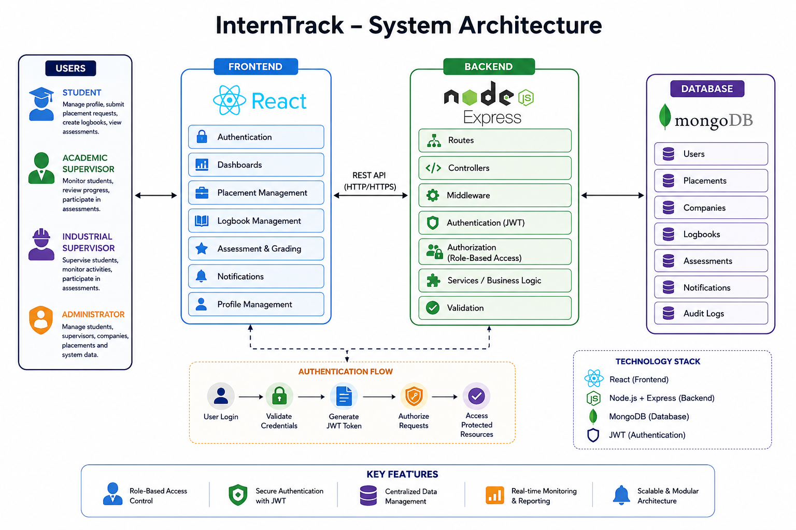

# InternTrack

A web-based Industrial Attachment Management System designed to
streamline the management of student internships between students,
academic supervisors, industrial supervisors, and administrators.

## Overview

InternTrack provides a centralized platform for managing the
industrial attachment process, from student placement and supervision
to logbook submissions and assessment.

The system is designed around multiple user roles, each with
specific permissions and responsibilities.

## Problem

Managing student industrial attachments through manual processes can
make it difficult to track placements, supervision, logbooks,
assessments, and student progress.

InternTrack provides a centralized system for organizing these
activities and improving communication between students, academic
staff, industrial supervisors, and administrators.

## Key Features

- Student registration and authentication
- Role-based access control
- Student placement management
- Industrial supervisor management
- Academic supervisor management
- Placement request management
- Logbook management
- Student assessment and grading
- Administrative management
- RESTful API architecture
- MongoDB-based data storage

## User Roles

### Student
- Manage personal information
- View placement information
- Submit placement requests
- Manage industrial attachment activities
- Submit logbook information
- View relevant academic information

### Academic Supervisor
- Monitor assigned students
- Review student progress
- Participate in assessment activities

### Industrial Supervisor
- Supervise assigned students
- Monitor industrial attachment activities
- Participate in student assessment

### Administrator
- Manage students
- Manage supervisors
- Manage companies
- Manage placements
- Manage system information

## Authentication & Access Control
## 🔐 Security & Access Control
Security is incorporated into InternTrack through authentication
and role-based authorization.

### Authentication
The backend uses JSON Web Tokens (JWT) to authenticate users and
protect access to authenticated resources.
The authentication process includes:

1. User login
2. Credential validation
3. JWT token generation
4. Token verification on protected requests
5. Access to authorized resources

### Role-Based Access Control
InternTrack uses role-based access control to ensure that users can
only access functionality appropriate to their assigned role.
The system supports four primary roles:

- Student
- Academic Supervisor
- Industrial Supervisor
- Administrator

Protected backend routes use authentication and authorization
middleware to control access to resources.

### Security Considerations
The project is designed with the following security considerations:

- JWT-based authentication
- Role-based authorization
- Protected API endpoints
- Server-side validation
- Separation of frontend and backend responsibilities
- Environment variables for sensitive configuration

Sensitive credentials and secrets should not be committed to the
repository.

## 📸 Screenshots

### Login



### Student Dashboard



### Administrator Dashboard



### Supervisor Dashboard



### Placement Management



### Logbook & Assessment



## System Architecture
InternTrack follows a client-server architecture consisting of a React
frontend, Node.js/Express backend, and MongoDB database.



The system supports multiple user roles and uses JWT-based
authentication and role-based access control to protect backend
resources.
### Request Flow
A typical authenticated request follows this flow:
User
→ React Frontend
→ REST API
→ JWT Authentication
→ Role-Based Authorization
→ Controller / Business Logic
→ MongoDB
→ Response
→ React Frontend

## Technology Stack
### Frontend
- React
- JavaScript
- HTML
- CSS
- 
### Backend
- Node.js
- Express.js
- JavaScript

### Database
- MongoDB

### Authentication
- JSON Web Tokens (JWT)

### Development Tools
- Git
- GitHub
- VS Code

## Getting Started.. Clone the repository
git clone https://github.com/Haggla123/interntrack.git
cd interntrack

## Install dependencies
Frontend:
cd client
npm install

## Backend:
cd ../server
npm install

## Future Improvements
- Improved notification system
- More detailed analytics and reporting
- Enhanced security testing
- Automated testing
- Expanded monitoring and progress tracking

## Project Structure

```text
interntrack/
├── client/
│   └── React frontend
│
├── server/
│   └── Express backend
│
└── README.md
